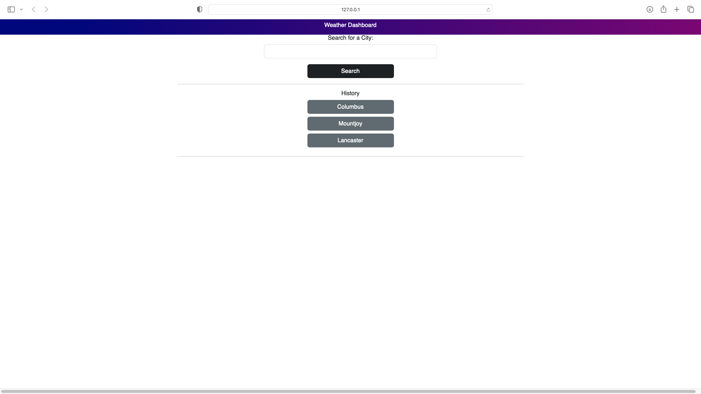
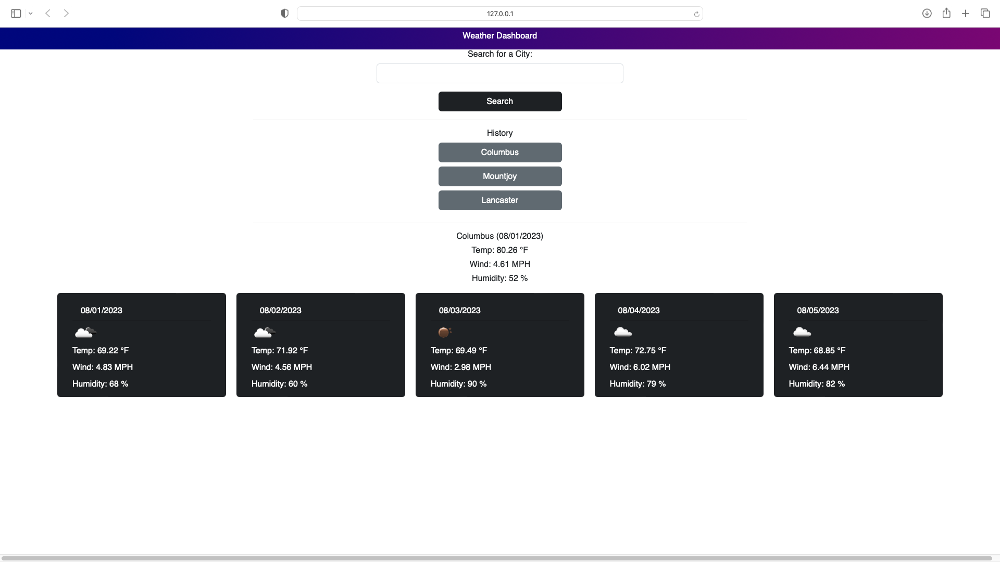

# <Weather-Dashboard>

## Description

I created this application to enable myself and others to quickly pull weather data for any location.
## Table of Contents (Optional)

- 
  - [Description](#description)
  - [Table of Contents (Optional)](#table-of-contents-optional)
  - [Installation](#installation)
  - [Credits](#credits)
  - [License](#license)
  - [Features](#features)
  - [Images](#images)

## Installation

Clone the code via your terminal, open in an IDE, right click on index.html and open with a live server.

## Credits

OSU homework week 6 for server side APIs recap. Project example to get the text for the application(prompts, headings, etc to stay true to the reqs)

## License

MIT

## Features

An easy to use application, search bar for any city, search history to frequently check locations that matter to you, todays forecast isolated at the top, and a 5 day forecast below featuring temp, wind, humidity, the date, as well as a weather forecast icon.

## Images

